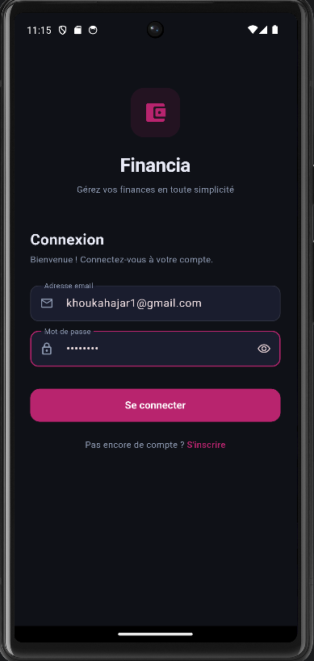
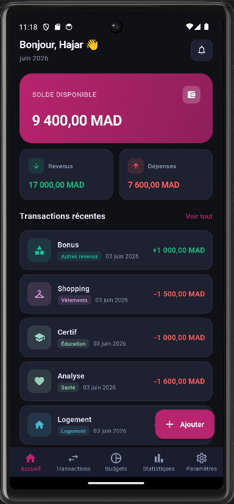
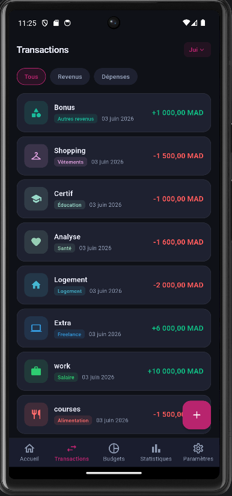
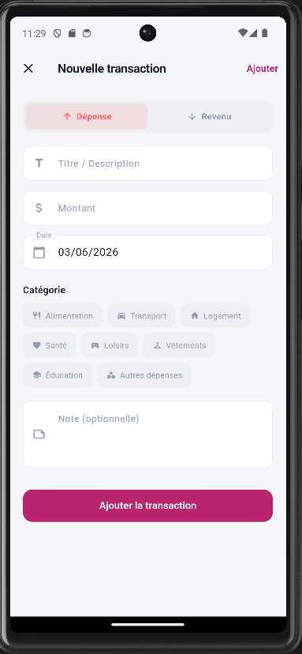
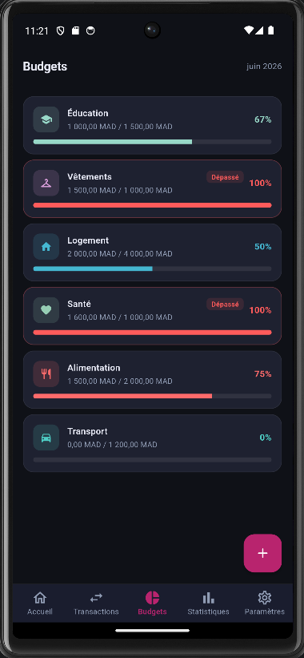
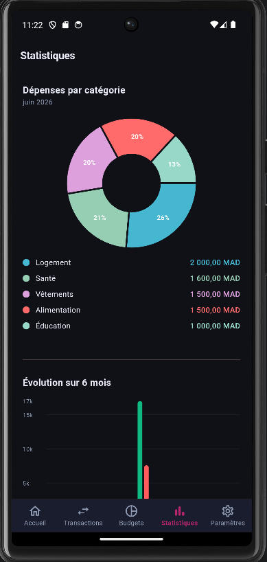
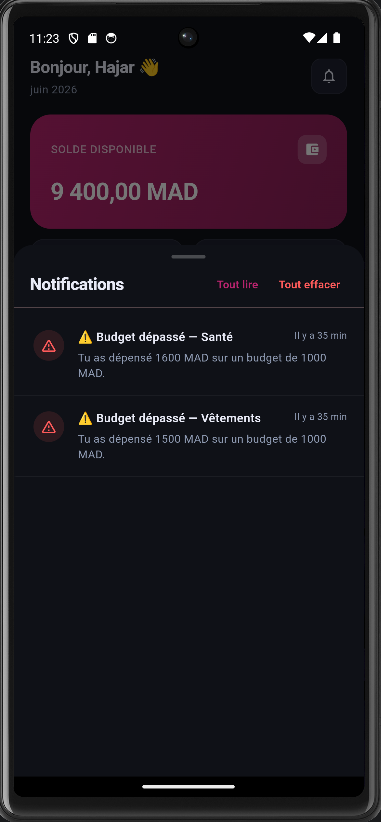
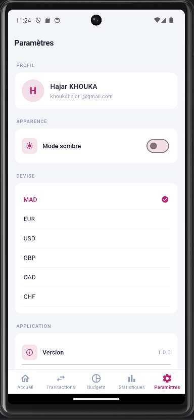

# 📱 Financia — Application de Gestion Budgétaire Personnelle

**Financia** est une application mobile moderne, ergonomique et performante développée avec **Flutter**. Elle permet aux utilisateurs de suivre leurs transactions financières (revenus et dépenses), d'établir des budgets mensuels par catégorie et de visualiser leurs statistiques sous forme de graphiques interactifs.

Ce projet s'inscrit dans le cadre académique pour valider les compétences avancées en développement mobile Flutter, le respect des architectures logicielles et l'intégration de fonctionnalités avancées.

---

## 📸 Captures d'écran

Vous trouverez ci-dessous les visuels clés de l'application. Pour les afficher sur GitHub, déposez vos captures d'écran au format PNG dans le dossier `screenshots` à la racine du projet sous les noms spécifiés.

| Connexion & Inscription | Tableau de Bord | Transactions | Saisie de Transaction |
| :---: | :---: | :---: | :---: |
|  |  |  |  |

| Budgets Mensuels | Statistiques & Analyses | Centre de Notifications | Paramètres |
| :---: | :---: | :---: | :---: |
|  |  |  |  |


---

## 🎯 Objectifs Pédagogiques Couverts

L'application a été entièrement conçue et structurée pour répondre aux exigences du projet :

- **Architecture Logicielle MVC (Modèle-Vue-Contrôleur)** : Séparation stricte de la logique métier, des modèles de données et de l'interface graphique pour assurer la maintenabilité et la testabilité du code.
- **Gestion des Données & Persistance Locale (SQLite)** : Utilisation d'une base de données locale relationnelle pour enregistrer et persister les données utilisateurs, catégories, transactions, budgets et notifications.
- **Consommation d'API & Stratégie Offline-First** : Synchronisation asynchrone des données locales vers un serveur API REST (ex: `json-server`) garantissant le fonctionnement continu de l'application hors-ligne.
- **Authentification & Sécurité** : Système de session utilisateur (inscription/connexion) avec hachage cryptographique des mots de passe en **SHA-256** localement avant stockage.
- **Design UI/UX & Animations** : Design moderne avec gestion dynamique du **Mode Sombre/Clair**, micro-animations de cascade fluides, transitions et retours haptiques visuels (Swipe-to-dismiss, badges de notification).
- **Notifications Hybrides** :
  - **Notifications Système Android** : Déclenchement d'alertes via le canal système lors de l'approche (80%) ou du dépassement (100%+) d'un budget.
  - **Centre de Notifications In-App** : Historique persistant des alertes stocké en base de données avec badge de lecture, marquage global et suppression tactile.

---

## 🌟 Fonctionnalités Principales

| Fonctionnalité | Description |
|---|---|
| 🔐 **Authentification Sécurisée** | Inscription et connexion avec validation de formulaire, persistance de session (Auto-Login) et mots de passe hachés en **SHA-256** via la bibliothèque `crypto`. |
| 📊 **Tableau de Bord Dynamique** | Résumé du solde disponible, des revenus et des dépenses du mois en cours avec affichage des transactions récentes. |
| 💸 **Gestion Budgétaire Avancée** | Définition de budgets mensuels par catégorie de dépenses. Suivi visuel du niveau de consommation avec barres de progression dynamiques colorées. |
| 📈 **Statistiques Interactives** | Graphiques détaillés (diagramme circulaire des dépenses par catégorie, historique d'évolution sur 6 mois des revenus vs dépenses) animés à l'aide de `fl_chart`. |
| 🔔 **Système d'Alertes intelligent** | Déclenchement de notifications système en temps réel si un budget atteint **80%** (avertissement) ou **100%** (dépassement critique) suite à l'ajout d'une transaction. |
| 🗂️ **Centre de Notifications In-App** | Accessible depuis le tableau de bord avec un badge dynamique du nombre d'alertes non lues. Permet de consulter l'historique, de marquer comme lu ou d'effacer (Swipe-to-dismiss). |
| 🌓 **Thème Sombre / Clair** | Gestion dynamique du thème avec sauvegarde des préférences de l'utilisateur (`shared_preferences`). |

---

## 🏗️ Architecture du Projet (Structure MVC)

Le code source est organisé selon une architecture propre et modulaire dans le dossier `/lib` :

```text
lib/
├── controllers/          # 🧠 Logique métier et Gestion d'état (Controllers)
│   ├── auth_controller.dart          # Session utilisateur, inscription/connexion
│   ├── budget_controller.dart        # Calculs de budgets et détection d'alertes
│   ├── transaction_controller.dart   # Chargement, calculs de soldes et CRUD transactions
│   ├── notification_controller.dart  # Gestion réactive des notifications in-app
│   └── theme_controller.dart         # Gestion du thème sombre/clair
├── models/               # 💾 Modèles de données (Models)
│   ├── user_model.dart               # Utilisateur
│   ├── transaction_model.dart        # Transaction (Revenu/Dépense)
│   ├── category_model.dart           # Catégorie de transaction
│   ├── budget_model.dart             # Budget mensuel
│   └── notification_model.dart       # Alerte/Notification
├── services/             # ⚙️ Services techniques
│   ├── database_service.dart         # Gestion SQLite (Migration, tables, requêtes CRUD)
│   ├── api_sync_service.dart         # Synchronisation API REST (json-server)
│   └── notification_service.dart     # Service des notifications système locales
├── utils/                # 🛠️ Constantes et Helpers graphiques
│   ├── app_constants.dart            # Constantes globales, routes, helpers de formatage
│   └── app_theme.dart                # Définition complète des thèmes Clair et Sombre
├── views/                # 🎨 Interfaces Utilisateurs (Views)
│   ├── auth/                         # Écrans de Login et Register
│   ├── splash/                       # Écran d'accueil animé (Splash Screen)
│   ├── home/                         # Écran principal avec barre de navigation inférieure
│   ├── dashboard/                    # Tableau de bord principal & widgets
│   ├── budgets/                      # Gestion des budgets par catégorie
│   ├── stats/                        # Graphiques statistiques
│   ├── settings/                     # Préférences de l'application (Thème, Devise, Déconnexion)
│   └── widgets/                      # Composants UI réutilisables et animés
└── main.dart             # 🚀 Point d'entrée de l'application (Routage et Providers)
```

---

## 🔌 Dépendances Principales (Packages)

L'application s'appuie sur des bibliothèques robustes de l'écosystème Flutter :

- **`provider`** : Pour la gestion d'état réactive (State Management) et l'injection de dépendances.
- **`sqflite` & `path`** : Pour la base de données SQLite embarquée sous Android.
- **`shared_preferences`** : Stockage persistant clé-valeur pour les préférences de thème et de devises.
- **`crypto`** : Hachage sécurisé des mots de passe.
- **`fl_chart`** : Graphiques financiers élégants et animés.
- **`http`** : Communication réseau avec le serveur de synchronisation.
- **`flutter_local_notifications`** : Gestion des notifications locales du système Android.
- **`intl`** : Internationalisation et formatage des devises (`MAD`, `EUR`, etc.) et des dates.

---

## 🚀 Guide de Démarrage et Lancement

### 1. Prérequis
Assurez-vous d'avoir installé :
- Le **SDK Flutter** (version >= 3.11.4)
- Un émulateur Android (ou appareil physique) avec les services activés.

### 2. Installation des dépendances
À la racine du projet, téléchargez les packages requis :
```bash
flutter pub get
```

### 3. (Optionnel) Lancer le serveur API de synchronisation
Pour simuler l'API REST en arrière-plan, vous pouvez lancer `json-server` sur votre machine locale (si configuré) ou utiliser l'application directement en mode autonome (SQLite prend le relais automatiquement de manière transparente en cas d'indisponibilité du serveur).
```bash
npx json-server --watch db.json --port 3000 --host 0.0.0.0
```

### 4. Lancer l'application
Démarrez l'application sur votre émulateur :
```bash
flutter run
```

> [!TIP]
> **Stabilité Graphique de l'émulateur** : Nous avons configuré l'application pour utiliser le moteur de rendu **Skia** à la place d'Impeller sous Android via le fichier `AndroidManifest.xml`. Cela élimine les bugs graphiques (étirements de polygones) fréquents sur les pilotes des émulateurs sous Windows.

---

## 💡 Bonnes Pratiques de Développement Appliquées

1. **Async & Thread-Safety** : L'accès à la base de données SQLite se fait via un patron de conception *Singleton* et des opérations asynchrones thread-safe (`Future` et `lock` implicites SQLite).
2. **Robustesse Offline** : Toutes les écritures se font en local de manière immédiate. Les requêtes API REST vers le serveur s'exécutent en arrière-plan non bloquant pour garantir une réactivité instantanée pour l'utilisateur.
3. **Optimisation des Alertes** : L'in-app stocke l'historique des dépassements et mémorise l'état pour éviter de renvoyer une notification déjà émise au lancement de l'application.
4. **Clean Code** : Typage fort, validation stricte des formulaires de saisie, gestion des exceptions et formatage français standard pour les dates et devises (ex: `MAD`).
